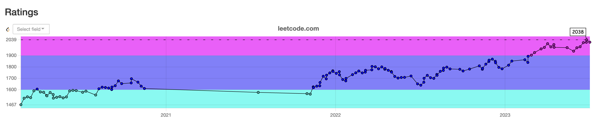

# 开篇

此专栏用来记录自己的算法技巧总结，以及讲解一些算法题目，希望能够帮助到大家。

首先介绍一下我自己，我虽然是科班出身，但大学四年的时间里，我并没有认真学习过专业知识，每次期末考试都是临时抱佛脚，这也是导致我校招失利的主要原因(基础太差)。20年初裸辞找下一份工作的时候，开始接触到了算法题，我也是以[两数之和](https://leetcode.cn/problems/two-sum/)开始了我的算法学习之路。从零开始学习一门技能是艰难的，尤其是它短时间无法得到反馈，好在我坚持下来了，并且刷题目的逐渐从**为了找工作**变成了**热爱**，我每天都会完成[力扣](https://leetcode.cn/problemset/all/)的每日一题，每周也会参加竞赛来检验我的成长。

附一张我竞赛分数趋势图，虽然分数不是很高，但是我觉得很有意义，它记录了我每周的成长，也是我坚持的动力之一。

在这个过程中，我走了很多弯路，也总结了一些刷题的经验与技巧希望与你分享，如果你感觉对你有帮助，欢迎分享给更多的人。

## 为何要学习算法

大道理大家都懂，数据结构和算法是程序员基础，像一个武侠者的内功一样重要。算法可以帮助我们解决很多实际问题，提高个人的编程能力，提高代码质量等。但对于大部分岗位（非算法之类的岗位），平常工作中可能很难使用到算法，这也是大家都会忽略它的原因吧。这里我说一下我对学习算法好处的一些见解和事例：

1. **提高就业竞争力**：正如上面说到，我接触算法也是因为要找工作，一些大厂还是会考察面试者的算法能力，很多人都会在找工作的期间，突击准备算法来应对面试。所以当你拥有一定的算法能力，它会作为你的亮点，可能会获得更好工作机会以及报酬。

::: tip 举例
 - 2020年我面试阿里乌鸫，当时第一道题被考到[LRU缓存](https://leetcode.cn/problems/lru-cache/)，由于当时刚开始刷算法，掌握并不熟练，只是知道要用链表实现，却写不出来，当时面试官立即pass，挂断面试。（面试官做法也极其残忍，面试体验极差）

 - 2020年我面试腾讯，笔试题被考到[最长递增子序列](https://leetcode.cn/problems/longest-increasing-subsequence/)，虽然有准备，但因为没完全理解，做题中导致变量写错，排查太久找不到原因被pass。

 - 2020年我面试字节，笔试题被考到[两数之和](https://leetcode.cn/problems/two-sum/)，对你没看错，字节大厂居然考了我一道入门题，就像是英语老师问你 `abandon` 是什么意思一样。虽然是简单题，但这道题我充分展示了我的能力，我写出了很多种解法，并且给出了时间复杂度。个人认为给面试官留下了好印象

 - 2020年我面试阿里拍卖，笔试题被考到[对称二叉树](https://leetcode.cn/problems/symmetric-tree/)，我也顺利通过笔试。
:::

2. **提高个人能力&代码质量**：好的算法可以降低代码复杂度，减少代码运行时间。这对于庞大的、复杂的逻辑处理、对性能时间较敏感的项目工程尤其重要。并且掌握算法对于阅读开源项目也有一定的帮助。
::: tip 举例
 - 在工作中处理一些树结构的数据时，往往要深度使用递归。我个人面试一些同学的时候，往往因为不能优雅处理 `TreeSelect` 组件的数据源而被淘汰

 - Vue 框架源码中，在做新老组件 diff 的时候，用到了[最长递增子序列](https://leetcode.cn/problems/longest-increasing-subsequence/) 来计算不需要处理的dom，减少dom操作，优化性能。[具体源码](https://github.com/vuejs/core/blob/main/packages/runtime-core/src/renderer.ts#L2409C24-L2409C24)

 - React、Vue 框架源码中，都会使用**位运算技巧**来处理标志位，比如一个`person`对象可能包含多个角色，朴素做法是定义多个变量 `isFather`，`isSon` 等，但通过 **位运算技巧** 可以把状态压缩到一个二进制数字中，通过 `| 运算`就可以添加角色，通过 `& 运算`就可以判断是否包含该角色。 [React具体源码](https://github.com/facebook/react/blob/main/packages/react-reconciler/src/ReactFiberLane.js#L37C94-L37C94)、[Vue具体源码](https://github.com/vuejs/core/blob/main/packages/shared/src/patchFlags.ts#L86C23-L86C23)。
:::

通过上面的举例，你应该能感受到算法带给我们的好处，所以学习算法还是有必要的，你目的可以是为了找工作，也可以为了提升自己的思维能力等等。但如果盲目的做题，没有一个规划，没有积累一定技巧，这可能会让你掉进一个陷阱，就是感到自己很努力，却丝毫不进步。所以我们来看下，该如何刷题，以最小的成本达到自己的目的。

## 如何刷题

我认为做到以下几点，可以称作为高效刷题，可以短时间内提升算法能力：

1. **按照分类刷题，但别追求完美**

    大部分新手(包括我)一开始都盲目的刷题，这些题之间没有关联，对于新手很难一下子记住所有知识点，这样的效率是低下的，并且会打击到新手的自信心。正确的做法是**按照分类刷题**，我们需要找个题单去刷题，题单可以是

    - 一个算法知识点，比如[LeetBook](https://leetcode.cn/leetbook/)中的各个知识点，由浅入深的学习每个知识点，一步一个脚印提升自己，具体怎样的一个顺序可以去搜索下大佬的建议

    - 高频题目，比如[剑指offer](https://leetcode.cn/studyplan/coding-interviews/)，这种题单里的题目出现频率较高，对于需要应付面试的很有用，运气好的话碰到的都是原题

    - 算法技巧类题单，有时候做算法题需要一些技巧，这些技巧并不像知识点那样摆在明面上，需要有一定的做题经验才会领略到。比如大家知道动态规划，但动态规划的题目可以细分**线性DP**、**区间DP**、**树形DP**、**状态机DP**，每一种技巧都有自己独特的解法。所以想要进阶的话，还需要掌握各种技巧，后续我也会在此专栏分享我学习到的技巧及对应的题单

    有了题单后，我们要切记**别追求完美**，我一开始就比较追求完美，打开一个题单后，就要把里面所有题目都做出来，都弄清楚，再去学下一个。但有的题目难度可能高于了自己所处难度，并且可能一道题目包含了多种知识点，想学会需要耗费大量时间，还容易记不住。学会给自己留有余地，掌握了大部分后就可以扩充其他知识点，等自己有能力了再回头拿下它。

2. **不要死磕，也不要过早放弃**

    **不要死磕**，我们碰到一个题目，如果想了很长时间都没思路，可以选择看题解，因为想不出来可能是某个知识点、某个技巧你还不会，不要浪费太多的时间在一道题目上。现在力扣也出了计时功能，可以给自己设定个阈值，超过阈值就去看题解或者选择跳过。

    **但也不要过早放弃**，如果阈值设置的很小也是没意义的，比如2分钟想不来就去看题解，这样思考时间过短也不利于提升自己的思维能力。有的时候即使想不出来最终解法，但在这个过程中可能也巩固了一个知识点。

    所以这个阈值需要自己去尝试，找到一个可以锻炼自己思维，又不浪费时间的一个度

3. **多总结，多输出**

    > 这一点我做的就很差，算是我进步缓慢的一个原因吧

    每一道题目都要**学会总结**，建议大家不管有没有做出来，都要去看一下此题精选题解，然后学习其他解法，以及大佬的思考问题的思路。学会举一反三，有精力的可以看下关联题目是否可以用同一个思路做出来，把类似思路的题目放到一起，也可以形成一个自己的题单。

    **学会输出**，自己掌握了不代表完全掌握，能讲给别人听懂才算是真的掌握。对外输出不仅可以提升自己的文档能力，同时也起到了巩固知识点的作用，俗话说：**温故而知新，可以为师矣**。这也是我开此专栏的目的之一。

4. **查缺补漏，攻克弱项**

    在刷题的过程中，往往会遇见自己没接触到的知识点，这个时候要找时间去补习它，慢慢的点亮自己的知识树。有一些知识点是有难度的，并不是很容易就可以掌握，比如动态规划。但我们不要畏惧它，要战胜它。只有这样我们的算法能力才会有质的飞跃。

## 学习资源

1. [liuyubobobo](https://github.com/liuyubobobo) 老师，之所以称作老师是因为他带我入门了**数据结构与算法**，他对每一个知识点都讲解的非常非常详细，由浅入深的带你领略算法的魅力。我在学习的过程中，不禁感叹如果大学教数据结构的老师是他，可能我也不会放弃那么干脆。bobo 老师在慕课网出了很多课程，彼此之间可能存在一些重复，读者可以自行判断学习哪些。

2. [灵神](https://space.bilibili.com/206214/dynamic?spm_id_from=444.41.list.card_title.click) 是在我参加周赛的时候发现的，力扣全国竞赛Top10，每周日他会在B站直播教大家竞赛题的思考过程，并且他也有录制[基础算法精讲系列](https://space.bilibili.com/206214/channel/collectiondetail?sid=842776&ctype=0)，我竞赛分从1800上升到2000+，其中灵神的视频帮助了我很多。到达1800是可以加入灵神的社群，跟着群里的大佬一起进步

3. 待补充...（可能有其他大佬也同样帮助着咱们，期待着你的推荐）